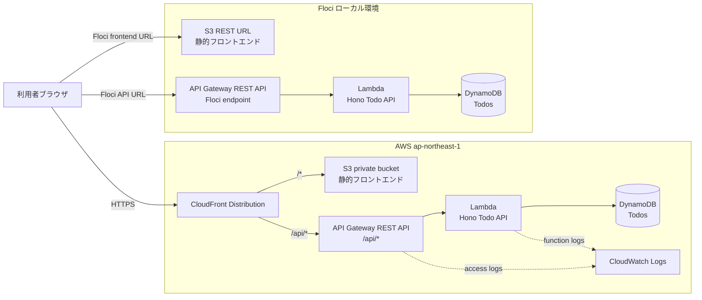
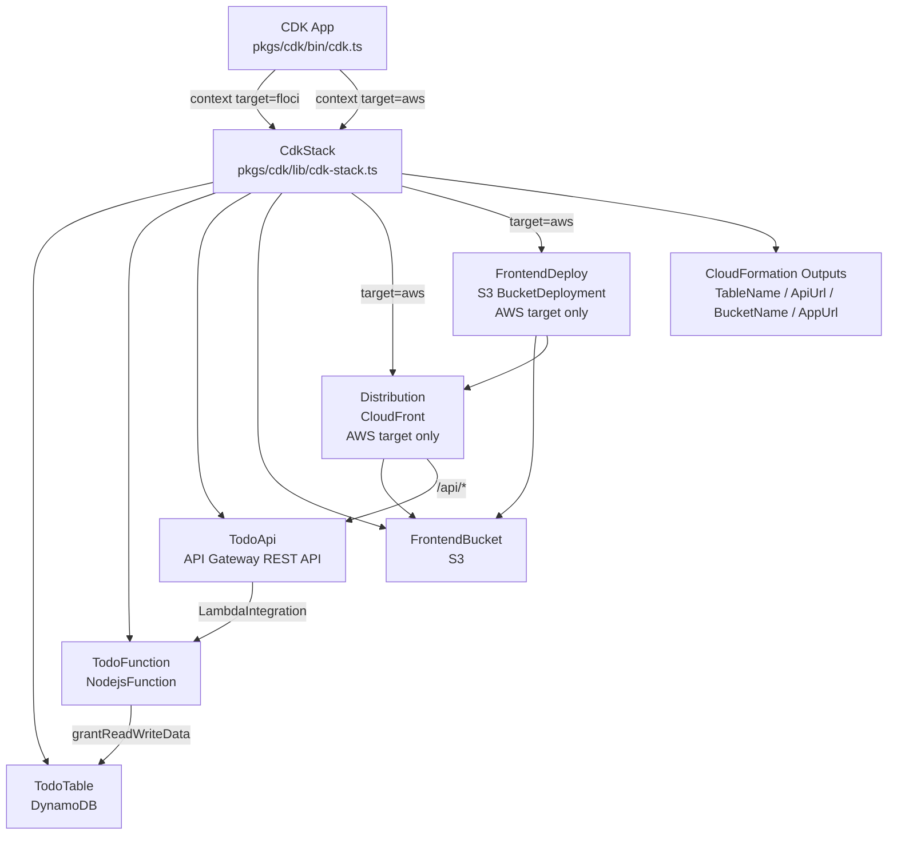
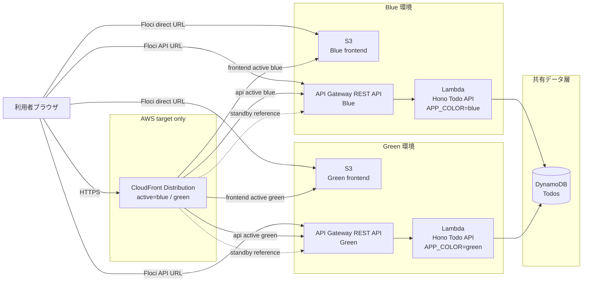
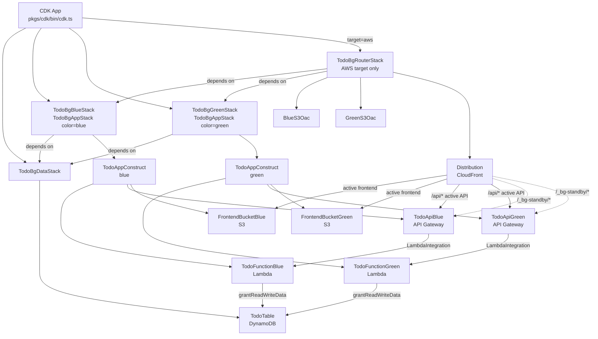

# floci-sample

flociについて学習するためのサンプル

## 概要

`floci-sample` は、Floci を使って AWS 互換のサーバーレス構成をローカルで学習・検証するためのサンプル集です。

現在は、単体の CDK サンプルに加えて、Todo アプリを題材にした `full-stack-serverless` と `full-stack-serverless-blue-green` の 2 つのフルスタック構成を含みます。どちらも React フロントエンド、Hono バックエンド、DynamoDB、Lambda、API Gateway、S3 を組み合わせ、Floci と実 AWS の両方を `target=floci|aws` で切り替えられる設計です。

| ディレクトリ | 内容 |
| --- | --- |
| `cdk/` | Floci 向けの基本 CDK サンプル。SQS と DynamoDB の学習用スタックを定義 |
| `full-stack-serverless/` | 単一スタックで Todo アプリ全体を構築するフルスタックサーバーレス構成 |
| `full-stack-serverless-blue-green/` | DynamoDB を共有し、Blue/Green のアプリ環境と CloudFront ルーターを分離した構成 |

## 技術スタック

| カテゴリ | 技術 |
| --- | --- |
| 言語 | TypeScript 5.9、ES2022、Node.js 22 以上 |
| フロントエンド | React 19、Vite、TanStack Query、openapi-fetch |
| バックエンド | Hono、@hono/zod-openapi、AWS SDK for JavaScript v3 |
| API 契約 | OpenAPI 3.1、Zod、openapi-typescript |
| インフラ | AWS CDK v2、Constructs v10 |
| ローカル AWS 互換環境 | Floci、Docker Compose |
| パッケージ管理 | pnpm 10.33.0、Bun |
| テスト | Jest、Vitest、React Testing Library |
| 品質管理 | Biome、TypeScript strict mode |

## 採用しているAWSサービス

| サービス | 用途 |
| --- | --- |
| Amazon DynamoDB | Todo データストア。`Todos` テーブルを PAY_PER_REQUEST で利用 |
| AWS Lambda | Hono アプリケーションを実行する API バックエンド |
| Amazon API Gateway REST API | `/api/*` の HTTP エンドポイント |
| Amazon S3 | React/Vite の静的フロントエンド配信先 |
| Amazon CloudFront | 実 AWS でのフロントエンド配信、`/api/*` ルーティング、Blue/Green 切り替え |
| Amazon CloudWatch Logs | 実 AWS での API / Lambda ログ保持 |
| Amazon SQS | `cdk/` の基本学習用キュー |
| AWS IAM | Lambda から DynamoDB への最小権限、S3 バケットポリシー、CloudFront OAC アクセス制御 |
| AWS CloudFormation | CDK によるスタック合成・デプロイ先 |

## full-stack-serverlessのシステム構成図

AWSアーキテクチャアイコンを使った編集可能な draw.io 版は [docs/diagrams/cdk-stack-architecture.drawio](docs/diagrams/cdk-stack-architecture.drawio) にあります。



## full-stack-serverlessのCDKスタック構成図



## full-stack-serverless-blue-greenのシステム構成図



## full-stack-serverless-blue-greenのCDKスタック構成図



## flociの立ち上げ方

```bash
docker run --rm -p 4566:4566 \
  floci/floci:latest
```

以下で起動を確認できます。

```bash
docker ps
```

```bash
CONTAINER ID   IMAGE                COMMAND                  CREATED          STATUS                    PORTS                                         NAMES
891ca2d2e988   floci/floci:latest   "/usr/local/bin/dock…"   27 seconds ago   Up 20 seconds (healthy)   0.0.0.0:4566->4566/tcp, [::]:4566->4566/tcp   exciting_ride
```

## AWS 設定

```bash
aws configure
```

## AWS CLIによるリソースの確認

```bash
aws --endpoint-url http://localhost:4566 \
  s3 mb s3://my-bucket

aws --endpoint-url http://localhost:4566 \
  sqs create-queue --queue-name my-queue

aws --endpoint-url http://localhost:4566 \
  sqs list-queues
```

## DynamoDB取得

```bash
aws dynamodb list-tables --endpoint-url "http://localhost:4566" --region "us-east-1"
```

## CDKはじめ方

```bash
cdk bootstrap
```

```bash
✅  Environment aws://000000000000/us-east-1 bootstrapped.
```

## CDKデプロイ

```bash
npm run deploy
```

## CDKデストロイ

```bash
cdk destroy --force
```

## CDKスタックファイルについて

学習・検証用に作成したCDKスタックファイルがいくつかあります。

## 検証に使用したAI Coding Agent

- Claude Code
- Codex

## SKILLについて

`floci-dev-assistant`を自作

## ハマったポイント

- 一部制約があるためそのままbootstrapするとエラーが起きる
  - 例えばECRが使えないなど
  - セットアップ等は専用のコマンド化してしまった方が良い
- ローカルとAWSでちゃんとアカウント情報を切り替える
  - process.env.CDK_DEFAULT_ACCOUNTを設定する
  - 切り替えられる設定にしておくとGood!

## 参考文献
- [GitHub floci](https://github.com/floci-io/floci)
- [floci 公式ドキュメント](https://floci.io/)
- [Deepwiki floci](https://deepwiki.com/floci-io/floci)
- [Floci完全ガイド：LocalStack代替のAWSローカル開発環境【起動24ms・29サービス対応・1850テスト】](https://ai-heartland.com/tool/floci/)
- [Flociが1ヵ月で41サービス対応へ - 怒涛のアップデートをまとめてみた](https://dev.classmethod.jp/articles/floci-one-month-update-41-services/)
- [LocalStack Community Editionの代替として登場したFlociを試してみた](https://dev.classmethod.jp/articles/floci-localstack-alternative-aws-emulator-try/)
- [Flociが公開から2ヵ月で52サービスへ、アップデートをまとめてみた](https://dev.classmethod.jp/articles/floci-two-months-52-services-update/)
- [Meet Floci: a fast, free, no-strings AWS emulator (no auth token, no quotas)](https://dev.to/hectorvent/meet-floci-a-fast-free-no-strings-aws-emulator-no-auth-token-no-quotas-2gdh)
- [Deepwiki floci 解説](https://deepwiki.com/search/floci_54868ce7-a23f-4223-bb60-eaba8c286c89)
- [【初心者向け】 LocalStackの概要と基本的な使い方について解説します](https://dev.classmethod.jp/articles/how-to-localstack/)
- [LocalStack を用いてローカルに AWS 環境を構築する](https://developers.play.jp/entry/2025/06/05/171137)
- [入門！ AWS Blocks](https://speakerdeck.com/ysuzuki/ru-men-aws-blocks)
- [【AWS Blocks 入門】AWSのIfCツール「AWS Blocks」を体験してみた！](https://qiita.com/yosuke-suzuki/items/aaac7afe22edf08d8d7d)
- [GitHub AWS Blocks](https://github.com/aws-devtools-labs/aws-blocks)
- [2026年6月 Flociアップデートまとめ、CloudFormationとWebコンソールに対応した1ヵ月](https://dev.classmethod.jp/articles/floci-2026-06-cloudformation-web-console-update/)