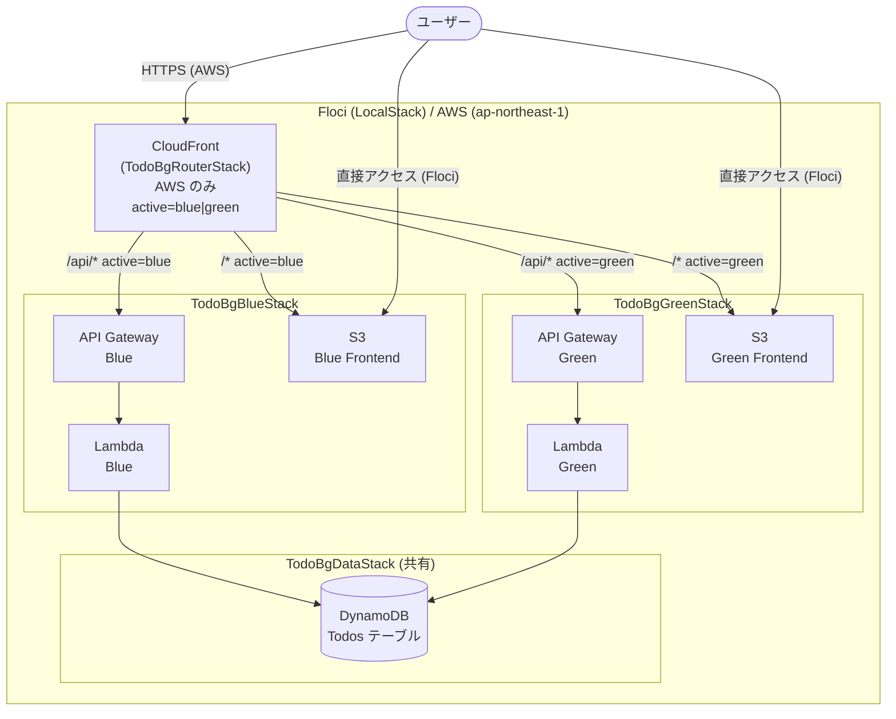

# Blue/Green サーバーレス Todo アプリ

DynamoDB を共有しつつ、S3・Lambda・API Gateway を Blue/Green に分離した Floci/AWS 両対応のサーバーレス Todo アプリです。

## 機能一覧

- Todo の CRUD 操作（作成・一覧・詳細・更新・削除）
- Blue/Green 環境の独立デプロイ（S3・Lambda・API Gateway を各色に分離）
- CloudFront による Blue/Green トラフィック切り替え（AWS デプロイ時）
- `scripts/switch.sh` でエンドポイント確認（Floci デプロイ時）
- 楽観更新（Optimistic Update）付きの React UI
- OpenAPI 3.1.0 仕様から自動生成した型安全 API クライアント
- フィルター機能（全て・未完了・完了済み）
- トースト通知（成功・エラー）

## 採用した AWS サービス一覧

| サービス | 用途 |
|---------|------|
| **Amazon DynamoDB** | Todo データストア（Blue/Green で共有） |
| **AWS Lambda (Node.js 22.x)** | API ロジック（Blue 用・Green 用それぞれ） |
| **Amazon API Gateway (REST)** | HTTP エンドポイント（Blue 用・Green 用それぞれ） |
| **Amazon S3** | フロントエンド静的ホスティング（Blue 用・Green 用それぞれ） |
| **Amazon CloudFront** | Blue/Green トラフィックルーター（AWS デプロイ時のみ） |

## システム構成図



## Blue/Green 切り替えの仕組み

| 環境 | 方法 |
|------|------|
| **Floci** | `pnpm switch blue` または `pnpm switch green` でアクティブなエンドポイントを確認 |
| **AWS** | `ACTIVE=green bash scripts/aws-guard.sh switch` で CloudFront の向き先を変更（RouterStack のみ再デプロイ） |

CDK context `active=blue|green` が CloudFront のオリジン選択を制御します。Blue/Green を切り替えても DynamoDB は共有のため、データの整合性が保たれます。

## 前提条件

- Node.js >= 22
- pnpm 10.33.0
- Docker（Floci 実行用）
- AWS CLI（Floci および AWS デプロイ用）
- jq（デプロイスクリプト用）

## パッケージ構成

```
full-stack-serverless-blue-green/
├── pkgs/
│   ├── shared/     @fsbg/shared    Zod スキーマ・型定義
│   ├── backend/    @fsbg/backend   Hono + DynamoDB API
│   ├── frontend/   frontend        React + Vite UI
│   └── cdk/        @fsbg/cdk       AWS CDK スタック
├── docs/
│   └── openapi.yaml                OpenAPI 3.1.0 仕様（自動生成）
└── scripts/                        デプロイ・運用スクリプト
```

## 動かし方 (Floci)

### 1. 依存関係インストール

```bash
cd full-stack-serverless-blue-green
pnpm install
```

### 2. Floci 起動と初期設定

```bash
# Floci (LocalStack) を起動
pnpm cdk floci:up

# ヘルスチェック
curl -f http://localhost:4566/_floci/health

# ローカル AWS 環境を初期化
pnpm cdk floci:setup

# CDK Bootstrap
pnpm cdk floci:cdk:bootstrap
```

### 3. アプリのデプロイ

```bash
pnpm deploy:floci
```

デプロイ完了後、Blue・Green それぞれの URL が表示されます。

### 4. Blue/Green エンドポイントの確認

```bash
# Blue エンドポイントを確認
pnpm switch blue

# Green エンドポイントを確認
pnpm switch green
```

### 5. API の動作確認

```bash
# Blue API でタスクを作成
BLUE_API_URL=$(jq -r '.TodoBgBlueStack.ApiUrlOutput' pkgs/cdk/cdk-outputs.json)
curl -X POST "$BLUE_API_URL/api/todos" \
  -H "Content-Type: application/json" \
  -d '{"title": "Floci から作成した Todo"}'

# Green API から同じデータを確認 (共有 DynamoDB)
GREEN_API_URL=$(jq -r '.TodoBgGreenStack.ApiUrlOutput' pkgs/cdk/cdk-outputs.json)
curl "$GREEN_API_URL/api/todos"
```

### 6. クリーンアップ

```bash
pnpm destroy:floci
pnpm cdk floci:down
```

## 動かし方 (AWS)

### 1. デプロイ（Blue アクティブ）

```bash
ACTIVE=blue AWS_ACCOUNT_ID=xxxxxxxxxxxx CONFIRM_AWS_DEPLOY=yes pnpm deploy:aws
```

### 2. Blue/Green 切り替え（CloudFront のみ更新）

```bash
# Green に切り替え
ACTIVE=green AWS_ACCOUNT_ID=xxxxxxxxxxxx CONFIRM_AWS_DEPLOY=yes bash scripts/aws-guard.sh switch

# Blue に戻す
ACTIVE=blue AWS_ACCOUNT_ID=xxxxxxxxxxxx CONFIRM_AWS_DEPLOY=yes bash scripts/aws-guard.sh switch
```

### 3. CloudFormation Diff 確認

```bash
AWS_ACCOUNT_ID=xxxxxxxxxxxx CONFIRM_AWS_DEPLOY=yes bash scripts/aws-guard.sh diff
```

### 4. クリーンアップ

```bash
AWS_ACCOUNT_ID=xxxxxxxxxxxx CONFIRM_AWS_DEPLOY=yes pnpm destroy:aws
```

## 開発環境での起動方法

```bash
# バックエンドとフロントエンドを同時起動（ホットリロード対応）
pnpm dev
```

- バックエンド: http://localhost:3000
- フロントエンド: http://localhost:5173 （/api は localhost:3000 にプロキシ）

## OpenAPI 仕様の再生成

```bash
# OpenAPI YAML の再生成
pnpm generate:openapi

# TypeScript 型の再生成
pnpm generate:types

# 両方まとめて実行
pnpm generate
```

## テスト

```bash
# 全パッケージのテスト実行
pnpm test

# 個別実行
pnpm --filter @fsbg/shared test   # Zod スキーマテスト
pnpm --filter @fsbg/backend test  # API エンドポイントテスト
pnpm --filter @fsbg/cdk test      # CDK スタック合成テスト
```

## 注意事項

- `TableName: "Todos"` は `full-stack-serverless` と同名です。両プロジェクトを同時に Floci にデプロイすると DynamoDB テーブルが競合します。同時使用時はいずれかのプロジェクトを先にデプロイ解除してください。
- AWS デプロイでは `CONFIRM_AWS_DEPLOY=yes` と `AWS_ACCOUNT_ID` の両方が必須です。
- Floci 環境では CloudFront (RouterStack) はデプロイされません。
