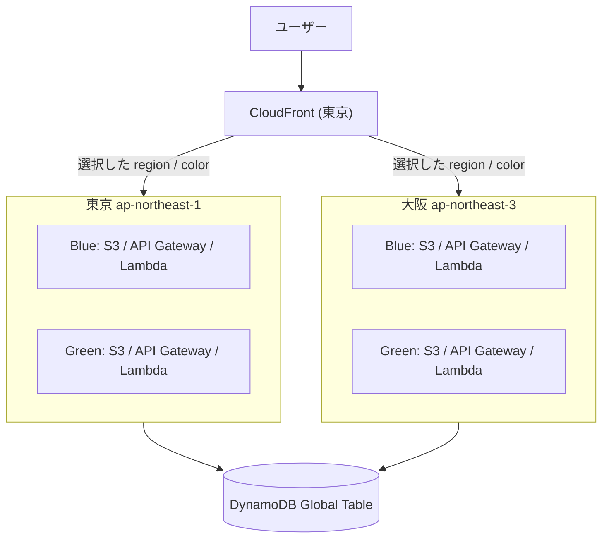

# マルチリージョン Blue/Green サーバーレス Todo アプリ

React、Hono、AWS CDK で構成した Todo アプリです。東京と大阪に Blue／Green の
アプリを配置し、CloudFront のオリジンを切り替えて配信先を選択します。

## 構成



- DynamoDB は東京・大阪レプリカを持つグローバルテーブルです。
- フロントエンドは `/api/health` の応答から、現在の色とリージョンを表示します。
- AWS の切替は `ACTIVE_REGION` と `ACTIVE_COLOR` を指定し、CloudFront だけを更新します。
- Floci はグローバルテーブルと CloudFront を再現せず、4環境のアプリ構成・CRUD・切替先をローカル検証します。

## Floci での検証

```bash
cd full-stack-serverless-multi-region-blue-green
pnpm install
pnpm cdk floci:up
pnpm cdk floci:setup
pnpm cdk floci:cdk:bootstrap
pnpm deploy:floci
pnpm destroy:floci

pnpm switch --region tokyo --color blue
pnpm switch --region osaka --color green
```

`pnpm deploy:floci` は東京／大阪 × Blue／Green の4環境に同じ Todo テーブルを接続します。これはアプリ切替の検証用であり、実際の DynamoDB レプリケーションは AWS 統合検証で確認してください。

## AWS へのデプロイと切替

実AWS操作には明示的な確認値が必要です。deploy は東京・大阪の CDK bootstrap、データ、4アプリ、静的ファイル、CloudFront の順で実行します。

```bash
ACTIVE_REGION=tokyo ACTIVE_COLOR=blue CONFIRM_AWS_DEPLOY=yes pnpm deploy:aws

ACTIVE_REGION=osaka ACTIVE_COLOR=green CONFIRM_AWS_DEPLOY=yes \
  bash scripts/aws-guard.sh switch

# 東京リージョンに戻す
ACTIVE_REGION=tokyo ACTIVE_COLOR=green CONFIRM_AWS_DEPLOY=yes \
  bash scripts/aws-guard.sh switch
```

切替前に対象 API の health を確認し、失敗時は CloudFront を更新しません。destroy はルーター、4アプリ、グローバルテーブルの順で削除し、Todo データも削除します。

```bash
CONFIRM_AWS_DEPLOY=yes pnpm destroy:aws
```

## 品質確認

```bash
pnpm format:check
pnpm typecheck
pnpm test
pnpm generate
pnpm cdk synth
pnpm cdk synth:aws
```

## データ整合性の注意

DynamoDB グローバルテーブルのレプリケーションは非同期です。別リージョンで同一 Todo を同時更新する運用は避け、切替直後は複製遅延を考慮してください。
