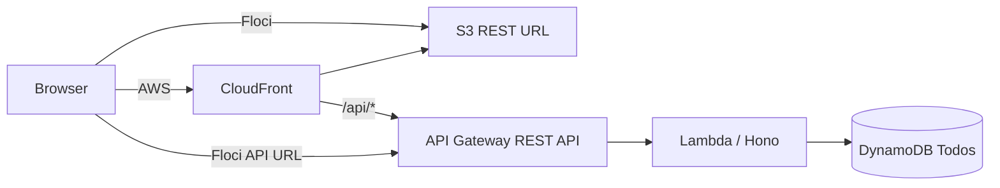

# Full Stack Serverless Todo

認証なし・単一利用者向けのTodoアプリです。同じReact/Honoコードを、ローカル開発、Floci統合環境、AWSへ展開します。

## 機能

- Todoの一覧、追加、編集、完了切替、削除
- 全件・未完了・完了フィルター、件数、空状態、再試行、通知
- TanStack Queryによる楽観更新と失敗時rollback
- Zodを正本とする入力検証、OpenAPI 3.1、生成API型
- DynamoDB条件式による重複作成・存在しないTodoの更新削除防止

## 構成

```text
.
├── docs/openapi.yaml
├── scripts/
├── pkgs/
│   ├── shared/    # Zod schemaと共有型
│   ├── backend/   # Hono、service、DynamoDB repository
│   ├── frontend/  # React、TanStack Query、openapi-fetch
│   └── cdk/       # target=floci|aws
└── .github/workflows/quality.yml
```



AWSではCloudFront、private S3、API Gateway、Lambda、DynamoDB、CloudWatch Logsを使います。FlociではCloudFrontを作らず、公開GET可能なS3 REST URLを使用します。

## API

| Method | Path | Result |
| --- | --- | --- |
| GET | `/api/health` | health |
| GET | `/api/todos` | `createdAt`降順の全件 |
| GET | `/api/todos/{id}` | 1件 |
| POST | `/api/todos` | 201で作成 |
| PATCH | `/api/todos/{id}` | 部分更新 |
| DELETE | `/api/todos/{id}` | 204で削除 |

成功は`{ "data": ... }`、エラーは`{ "error": { "code", "message", "details?" } }`です。詳細契約は[docs/openapi.yaml](docs/openapi.yaml)を参照してください。

## テーブル

`Todos`は文字列`id`をpartition keyとする`PAY_PER_REQUEST`テーブルです。GSIとページングはありません。一覧はScan後にアプリケーションで並べ替えます。物理定義、属性モデル、アクセスパターンは[pkgs/cdk/config/todo-table.json](pkgs/cdk/config/todo-table.json)にあります。

## セットアップ

Node.js 22とpnpm 10.33.0を使用します。

```bash
pnpm install
pnpm generate
pnpm dev
```

ローカル開発はViteが`/api`を`http://localhost:3000`へproxyします。backendにはDynamoDBが必要なため、`TODO_TABLE_NAME`とAWS SDKが参照するローカル環境を用意してください。

## Floci

Flociは`http://localhost:4566`、account `000000000000`、region `us-east-1`、dummy credentialsのみを使用します。

```bash
cd pkgs/cdk
pnpm floci:up
pnpm floci:setup
pnpm floci:cdk:bootstrap
cd ../..
pnpm deploy:floci
pnpm destroy:floci
```

`deploy:floci`は契約生成、品質確認、CDK deploy、環境別frontend build、S3 syncを順に実行します。destroy時は先にfrontend bucketを空にします。

```bash
Floci URL:

- App: http://localhost:4566/cdkstack-frontendbucketefe2e19c-e93ce050ea2d/index.html
- API: http://localhost:4566/restapis/98e13da8d7/v1/_user_request_
```

## AWS

AWS targetは`ap-northeast-1`です。標準確認ではdeployせず、次を実行します。

```bash
pnpm --filter @full-stack-serverless/cdk synth:aws
AWS_ACCOUNT_ID=123456789012 pnpm diff:aws
```

実deploy/destroyはaccount一致と明示確認が必要です。

```bash
AWS_ACCOUNT_ID=123456789012 CONFIRM_AWS_DEPLOY=yes pnpm deploy:aws
AWS_ACCOUNT_ID=123456789012 CONFIRM_AWS_DEPLOY=yes pnpm destroy:aws
```

## 品質確認

```bash
pnpm generate
pnpm format:check
pnpm lint
pnpm typecheck
pnpm test
pnpm build
pnpm --filter @full-stack-serverless/cdk synth
pnpm --filter @full-stack-serverless/cdk synth:aws
```

CIは生成差分も検査し、deployは行いません。

## 制約

- 認証、複数利用者、ページング、検索、共有、添付は対象外
- 学習環境のためDynamoDBを含む全リソースはdestroy可能
- 実AWSのdeploy/destroyは明示操作時のみ
