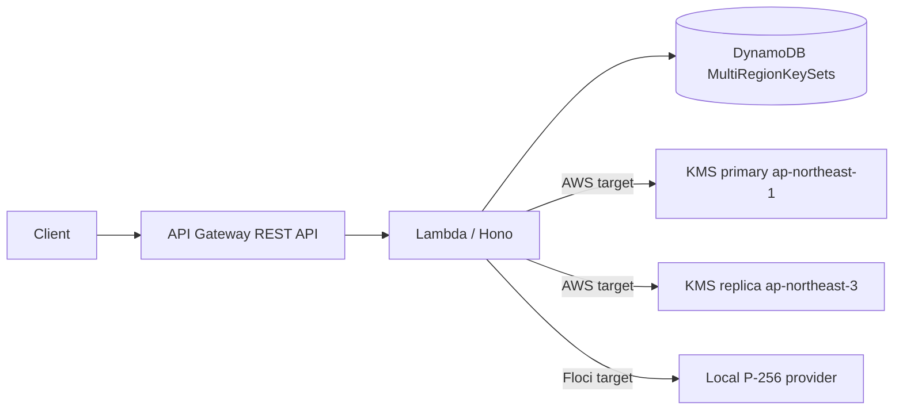

# Multi-Region KMS Key API

AWS KMS のマルチリージョン非対称キーを作成し、東京と大阪のどちらの関連キーでも署名・検証できることを確認する API サンプルです。AWS target は `ap-northeast-1` に API Gateway/Lambda/DynamoDB を置き、KMS primary を東京、replica を `ap-northeast-3` に作成します。Floci target は KMS 未対応でも検証できるよう、Node.js `crypto` による local provider を使います。

## API

成功は `{ "data": ... }`、失敗は `{ "error": { "code", "message", "details?" } }` です。契約は [docs/openapi.yaml](docs/openapi.yaml) が正本です。

| Method | Path | Result |
| --- | --- | --- |
| GET | `/api/health` | health |
| POST | `/api/key-sets` | 東京 primary、大阪 replica、alias、metadata を作成 |
| GET | `/api/key-sets` | key set 一覧 |
| GET | `/api/key-sets/{keySetId}` | key set 詳細 |
| DELETE | `/api/key-sets/{keySetId}` | replica と primary の削除予約 |
| POST | `/api/key-sets/{keySetId}/sign` | base64 message を `ECDSA_SHA_256` で署名 |
| POST | `/api/key-sets/{keySetId}/verify` | base64 signature を検証 |

`region` は `tokyo` または `osaka` です。署名方式は `ECC_NIST_P256` + `ECDSA_SHA_256` 固定です。

## 構成

```text
.
├── docs/openapi.yaml
├── scripts/
└── pkgs/
    ├── shared/   # Zod schema と OpenAPI 生成型
    ├── backend/  # Hono API、KMS provider、DynamoDB repository
    └── cdk/      # target=floci|aws
```



## セットアップ

Node.js 22 と pnpm 10.33.0 を使用します。

```bash
pnpm install
pnpm generate
pnpm format:check
pnpm lint
pnpm typecheck
pnpm test
pnpm build
```

## Floci

Floci は `http://localhost:4566`、account `000000000000`、region `us-east-1`、dummy credentials のみを使用します。

```bash
pnpm --filter @multiregion-key/cdk floci:up
pnpm --filter @multiregion-key/cdk floci:setup
pnpm --filter @multiregion-key/cdk floci:cdk:bootstrap
pnpm deploy:floci
```

`deploy:floci` は品質確認、CDK deploy、create/sign/verify/delete の smoke test を実行します。API URL は `CdkStack.ApiUrlOutput` に出力されます。

## AWS

実 AWS では deploy/destroy 前に account 一致と明示確認を要求します。API Gateway は API Key + Usage Plan を必須にします。

```bash
AWS_ACCOUNT_ID=123456789012 pnpm diff:aws
AWS_ACCOUNT_ID=123456789012 CONFIRM_AWS_DEPLOY=yes pnpm deploy:aws
AWS_ACCOUNT_ID=123456789012 CONFIRM_AWS_DEPLOY=yes pnpm destroy:aws
```

API Key の値は AWS コンソールまたは CLI で `ApiKeyIdOutput` から取得してください。

## 品質確認

```bash
pnpm generate
pnpm format:check
pnpm lint
pnpm typecheck
pnpm test
pnpm build
pnpm --filter @multiregion-key/cdk synth
pnpm --filter @multiregion-key/cdk synth:aws
```
